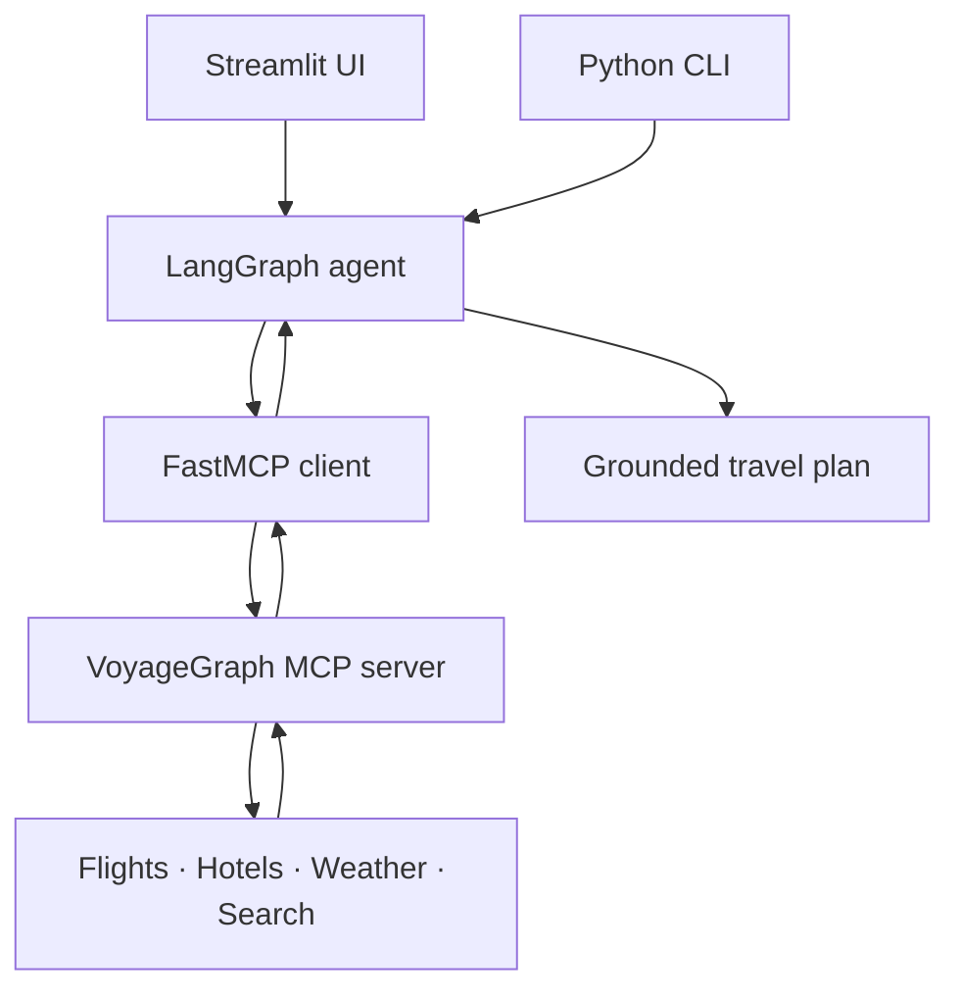

# VoyageGraph MCP — Agentic AI Travel Planner

VoyageGraph is a production-style travel-planning project that combines **LangGraph**, the
**Model Context Protocol (MCP)**, **Groq**, and **Streamlit**. The agent discovers tools from a
local FastMCP server, decides which ones a request needs, executes them, and writes a grounded
travel plan with clear verification notes.

> Recommended GitHub repository name: `voyagegraph-mcp-travel-planner`

## What makes this project different

- Real MCP client/server integration instead of direct Python tool imports in the agent.
- A LangGraph ReAct loop that chooses tools dynamically and can recover from API failures.
- Live Google Flights and Google Hotels snapshots through SerpApi.
- Current weather and forecasts through Open-Meteo, with no weather key required.
- Current destination research through Tavily with source URLs.
- Deterministic itinerary and budget tools for transparent calculations.
- A responsive Streamlit interface with visible capability status and an MCP activity trace.
- In-session plan persistence with contextual follow-up questions and complete-plan downloads.
- No PostgreSQL installation required for the default local setup.
- Secrets excluded from Git, plus automated syntax and unit checks in GitHub Actions.

## Architecture



The UI never calls travel providers directly. `src/travel_planner/agent.py` discovers the tool
schemas from `mcp_server.py`, binds them to the Groq model, and uses LangGraph to repeat
`agent → MCP tools → agent` until a final answer is ready.

The Streamlit session retains the generated plan and recent conversation so users can ask
follow-up questions without repeating the full trip brief. It does not write conversation data to
a database.

## MCP tools

| Tool | Purpose | Key required |
|---|---|---|
| `search_flights` | Live one-way Google Flights snapshot | SerpApi |
| `search_hotels` | Live Google Hotels snapshot | SerpApi |
| `get_weather_forecast` | Current conditions and up to 16-day forecast | No |
| `search_destination_guides` | Current destination and attraction research | Tavily |
| `create_itinerary` | Realistic day-by-day skeleton | No |
| `calculate_trip_budget` | Transparent INR allocation | No |

## Project structure

```text
.
├── .github/workflows/ci.yml       # automated checks
├── .streamlit/config.toml          # theme and privacy settings
├── .vscode/launch.json            # one-click VS Code run profiles
├── examples/sample_queries.md      # ready-to-run prompts
├── src/travel_planner/
│   ├── agent.py                    # LangGraph + MCP orchestration
│   └── config.py                   # safe environment configuration
├── tests/                           # offline calculations and MCP contract tests
├── tools/                           # compatibility wrappers
├── frontend.py                     # Streamlit interface
├── main.py                         # CLI entry point
├── mcp_server.py                   # FastMCP tools and API normalization
├── travel_mcp_server.py            # compatibility MCP entry point
├── pyproject.toml
└── requirements.txt
```

## Run in VS Code

### 1. Clone and open the project

```bash
git clone https://github.com/AnshMadanpuriya/AI-Travel-Planning-System-using-LangGraph.git
cd AI-Travel-Planning-System-using-LangGraph
code .
```

### 2. Create a virtual environment

Windows PowerShell:

```powershell
py -3.11 -m venv .venv
.venv\Scripts\Activate.ps1
```

Windows Command Prompt:

```bat
py -3.11 -m venv .venv
.venv\Scripts\activate.bat
```

macOS/Linux:

```bash
python3.11 -m venv .venv
source .venv/bin/activate
```

### 3. Install packages

```bash
python -m pip install --upgrade pip
pip install -e ".[dev]"
```

### 4. Add API keys

Copy `.env.example` to `.env`, then replace the placeholder values:

```env
GROQ_API_KEY=your_groq_api_key
GROQ_MODEL=openai/gpt-oss-120b
SERPAPI_API_KEY=your_serpapi_key
TAVILY_API_KEY=your_tavily_api_key
```

`GROQ_API_KEY` is required. SerpApi enables live flights and hotels. Tavily enables current
destination research. The weather tool works without an API key.

If an API key has ever been committed to GitHub, revoke it in the provider dashboard and create a
new one. Deleting `.env` in a later commit does not remove the old value from Git history.

### 5. Start the app

```bash
streamlit run frontend.py
```

Open the local URL shown in the terminal, normally `http://localhost:8501`.

You can also open VS Code's **Run and Debug** panel and choose
**VoyageGraph: Streamlit UI**. The MCP server starts automatically as a local stdio subprocess
when the agent handles a request; you do not need a second terminal.

## Other run modes

Interactive CLI:

```bash
python main.py
```

Single request:

```bash
python main.py "Plan a 5-day trip from Indore to Goa next month for two people"
```

Run the MCP server directly for inspection:

```bash
python mcp_server.py
```

Run checks:

```bash
python -m compileall -q .
pytest -q
ruff format --check .
ruff check .
```

Example requests are available in [`examples/sample_queries.md`](examples/sample_queries.md).

## Reliability and safety

- Flight and hotel data are search-time snapshots, never booking guarantees.
- The system prompt forbids invented fares, schedules, ratings, policies, and availability.
- Tool errors return structured messages so the agent can disclose missing verification.
- User-generated answers are rendered as Markdown, not injected as unsafe HTML.
- `.env`, generated plans, caches, and local environments are ignored by Git.
- Streamlit usage telemetry is disabled in the checked-in configuration.

## License

MIT — see [LICENSE](LICENSE).
