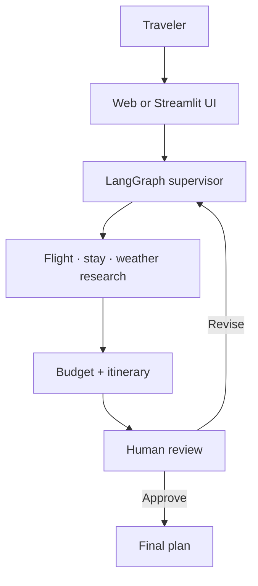

# AI Travel Agent System

A production-oriented, review-first travel planner consolidated from five LangGraph tutorial repositories. A supervisor validates each request and coordinates flight, stay, weather, budget, and itinerary specialists. The user reviews the draft, requests revisions, and explicitly approves the final plan.

**Live app:** [ai-travel-agent-ansh.anshmadanpuriya16.chatgpt.site](https://ai-travel-agent-ansh.anshmadanpuriya16.chatgpt.site)

> The application plans trips; it does not book, purchase, message providers, or guarantee price and availability.

## What is included

- LangGraph supervisor with deterministic input guardrails
- Flight and airport research through AviationStack
- Hotel/area web research through Tavily
- Near-date weather through Open-Meteo in the hosted app
- Local OpenWeather and AviationStack FastMCP servers in the Python runtime
- Budget allocation with a protected contingency reserve
- Day-by-day itinerary synthesis through Groq
- Human approval and feedback-driven revision
- Safe preview mode requiring no API key
- PostgreSQL checkpointing for Python human-in-the-loop resume
- Responsive web UI, Streamlit UI, Docker Compose, health checks, tests, and GitHub Actions CI

## Architecture



The root edge runtime powers the live site. `python_backend/` preserves the Python + Streamlit + PostgreSQL + FastMCP implementation from the supplied tutorial series. Both follow the same feature and safety contract.

## Quick start: hosted web runtime

Requirements:

- Node.js 22.13 or newer
- npm 10 or newer

```bash
git clone https://github.com/AnshMadanpuriya/AI-Travel-Planning-System-using-LangGraph.git
cd AI-Travel-Planning-System-using-LangGraph
npm ci
cp .env.example .env.local
npm run dev
```

Open the local URL printed by the development server. Preview mode works immediately without credentials.

Run the quality gates:

```bash
npm run lint
npm test
```

## Quick start: Python LangGraph + MCP runtime

The repeatable path is Docker:

```bash
cp .env.example .env
docker compose up --build
```

Open `http://localhost:8501`.

For a direct Python setup:

```bash
cd python_backend
python -m venv .venv
source .venv/bin/activate
pip install -r requirements.txt
streamlit run streamlit_app.py
```

On Windows PowerShell, activate with `.venv\Scripts\Activate.ps1`.

## Environment variables and API keys

Copy `.env.example`; never commit the resulting `.env` or `.env.local` file.

| Variable | Required | Used by | How to obtain / behavior |
|---|---:|---|---|
| `GROQ_API_KEY` | For live AI | Both runtimes | Create a key in the [Groq Console](https://console.groq.com/). Without it, the system uses a clearly labeled deterministic preview plan. Limits vary by model and account; check the [Groq rate-limit page](https://console.groq.com/docs/rate-limits). |
| `GROQ_MODEL` | No | Both | Defaults to `llama-3.3-70b-versatile`. Confirm current availability in [Groq supported models](https://console.groq.com/docs/models). |
| `TAVILY_API_KEY` | No | Both | Create a key in [Tavily](https://app.tavily.com/). Tavily currently lists 1,000 free credits/month; development keys are limited to 100 RPM. See [credits](https://docs.tavily.com/documentation/api-credits) and [rate limits](https://docs.tavily.com/documentation/rate-limits). |
| `AVIATION_STACK_API_KEY` | No | Both | Create a key at [AviationStack](https://aviationstack.com/). The current free plan lists 100 requests/month for personal use; paid commercial plans start above the free tier. See [pricing](https://aviationstack.com/pricing). |
| `OPENWEATHER_API_KEY` | Python MCP only | Python | Create a key at [OpenWeather](https://openweathermap.org/api). Current free allowance is listed as 1,000 calls/day with plan-specific rate limits. See [pricing](https://openweathermap.org/price). |
| `DATABASE_URL` | No | Python | PostgreSQL connection string for durable LangGraph checkpoints. Docker Compose supplies it automatically. Without it, Python uses in-memory checkpoints. |
| `TRAVEL_AGENT_DEMO_MODE` | No | Both | Set `true` to force safe preview mode even when provider keys exist. |

The hosted web runtime also calls Open-Meteo for near-date forecasts. Its free endpoint is non-commercial, attributed, and currently limited to 10,000 calls/day; commercial deployments must use a suitable plan or provider. See [Open-Meteo pricing](https://open-meteo.com/en/pricing).

Provider terms and quotas can change. Verify each dashboard before production use or budgeting.

## Main dependencies

| Runtime | Libraries |
|---|---|
| Web | React 19, Next.js 16, Vinext, TypeScript, `@langchain/langgraph`, `@langchain/core` |
| Python | LangGraph, LangChain Core, LangChain Groq, LangChain MCP Adapters, FastMCP, Streamlit |
| Persistence | PostgreSQL 16, `psycopg`, `langgraph-checkpoint-postgres` |
| External APIs | Groq, Tavily, AviationStack, OpenWeather, Open-Meteo |
| Delivery | Docker Compose, GitHub Actions, Cloudflare-compatible worker build |

Exact JavaScript versions are locked in `package-lock.json`. Python uses bounded direct-dependency ranges in `python_backend/requirements.txt` to avoid copying one machine's transitive package freeze.

## Repository structure

| Path | Purpose |
|---|---|
| `app/` | Web routes, metadata, and `/api/plan`, `/api/revise`, `/api/health` |
| `components/travel-planner.tsx` | Responsive planner, agent trace, budget, itinerary, review, and export UI |
| `lib/workflow.ts` | Edge LangGraph supervisor, parallel provider research, guardrails, and Groq composition |
| `lib/fallback-plan.ts` | Deterministic, key-free preview planner |
| `python_backend/app/` | Python agents, graph, provider clients, and local FastMCP servers |
| `python_backend/streamlit_app.py` | Python human-review interface |
| `docker-compose.yml` | Python app + PostgreSQL deployment |
| `tests/` | Rendered-site, health API, and end-to-end preview workflow tests |
| `.github/workflows/ci.yml` | Web build/lint/tests and Python workflow tests |
| `docs/SOURCES.md` | Mapping from all five GitHub repositories and tutorial videos into this project |
| `docs/DEPLOYMENT.md` | Hosted and Docker deployment runbook plus post-deploy checks |
| `SECURITY.md` | Credential rotation and safe-secret handling |

## API contract

### `POST /api/plan`

```json
{
  "origin": "Indore",
  "destination": "Tokyo",
  "startDate": "2026-10-10",
  "endDate": "2026-10-16",
  "travelers": 2,
  "budget": 200000,
  "currency": "INR",
  "travelStyle": "Balanced",
  "interests": ["Food", "Culture", "Nature"],
  "notes": "Avoid overnight flights"
}
```

### `POST /api/revise`

Send the prior `plan` object plus a `feedback` string. The entire request is revalidated before replanning.

### `GET /api/health`

Returns readiness, preview/live mode, and provider configuration booleans. It never returns credential values.

## Deployment

The web app is deployable as a Cloudflare-compatible worker. The Python version is deployable on a VPS or container platform with `docker compose up --build`. Full configuration, verification, and rollback steps are in [docs/DEPLOYMENT.md](docs/DEPLOYMENT.md).

## Important security action

The supplied source repositories contained committed `.env` files. This project removes them and prevents future commits, but old Git history still exists. Rotate every previously committed credential before enabling live mode. See [SECURITY.md](SECURITY.md).

## Source integration and tutorials

See [docs/SOURCES.md](docs/SOURCES.md) for the exact feature mapping, all five supplied repositories, embedded YouTube tutorials, corrections made during integration, and attribution notes.
